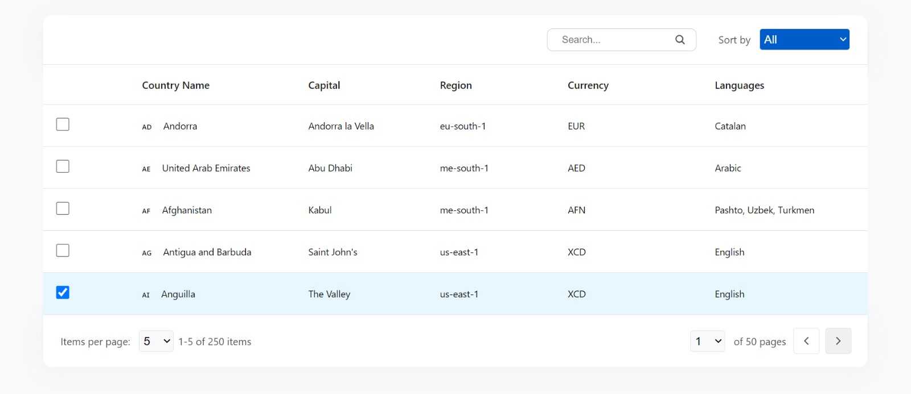

# React TypeScript Project: Frontend Developer Assignment

## Overview
This repository contains the completed Frontend Developer Assignment, implemented in React with TypeScript. The project focuses on list management and data handling, utilizing the GraphQL Countries open-source API for data retrieval.

## Table of Contents
Installation
Usage
Technologies Used
Features
Contributing

## Installation
To run the project locally, follow these steps:

### Clone the repository: git clone https://github.com/Semanur-Arslan/Frontend-Developer-Assignment-Done.git
### Navigate to the project directory: cd Frontend-Developer-Assignment-Done
### Install dependencies: npm install
### Start the development server: npm start

## Usage
The project utilizes React and TypeScript to create a dynamic user interface for list management. It retrieves data from the GraphQL Countries open-source API and checks this data regularly. Incoming data can be sorted, searched, and viewed with a user-friendly interface, providing users with a seamless experience to interact with and manage the displayed information.

### Features:
#### Search and Grouping Functions
Users can perform data searches quickly and effectively through the project's search section. Additionally, they have the ability to group data based on currency and region options, allowing them to filter information according to their areas of interest.

#### Pagination Functions
The project provides users with the ability to select page numbers and control the number of displayed data in the footer section. This enables smooth navigation through large datasets and facilitates the ease of viewing the desired amount of data.

## Technologies Used
React
TypeScript
